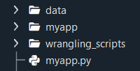

# Data Dashboard Template
This [template](http://carlklein-dashboard-template.herokuapp.com/) lays the foundation for creating a dashboard that can be uploaded
to a webpage using basic HTML, Flask, Plotly, and Bootstrap.

Discussed below (in this README), are the basics of this template and 
the process for uploading the webpage to a server. In this case,
the webpage was uploaded through a heroku server.

This was designed following a Udacity course project, but was completed outside
the Udacity environment. Both upload pathways will be detailed.


## Table of Contents
- [Libraries Used](#libraries-used)
- [Project Motivation](#project-motivation)
- [File Descriptions](#file-descriptions)
- [Directory Tree: Before](#directory-before)
- [Directory Tree: After](#directory-after)
- [Before the Upload](#before-the-upload)
- [Ubunto (Linux) Approach](#ubunto-linux)
- [Micrsoft Git Bash Approach](#microsoft-git-bash)
- [Ready to Upload](#ready-to-upload)
- [Notes on the Transformation](#notes-on-the-transformation)
- [Future Considerations](#future-considerations)


## Libraries Used
Note that once the app is ready to be uploaded, a requirements.txt file will be 
created. This file will be created in a virtual environment, a common recommendation. 
However, the following libraries are paramount to this template construction prior to 
a server upload.

- Flask
- Numpy
- Pandas
- Plotly

Additionally, the HTML file calls in a Bootstrap template. The Bootsrap website
features many templates which provide a front-end framework, essentially 
eliminating the need for CSS or Javascript.


[Table of Contents](#table-of-contents)


## Project Motivation
The initial objective was to practice creating a dashboard and uploading the
dashboard to a server to be reached like any other website.

However, the initial exercise supplied the following two opportunities:
1. Create a dashboard template that is quick to duplicate for multiple uses.
2. Create a detailed account of template creation and the upload process.

For the second point above, both the initial template creation and the upload
process came with their share of troubleshooting. Documenting the entire
troubleshooting process and sharing what was found will help not only recreate
this exact webpage, but hopefully other users finding the same issues.


[Table of Contents](#table-of-contents)


## File Descriptions
There will be three "sets" of files available in this repository:
1. Before the upload to a server phase
2. After the upload to a server phase
3. Supporting files and images for this repository and README

Visually, it'll help to examine the directory trees for the files and folders created 
for each phase. The files and folders locations and nomenclature can be confusing, so 
hopefully these maps will help.

Note that the pycache folders are automatically created.


## Directory Tree: Before




## Directory Tree: After


[Table of Contents](#table-of-contents)

## Before The Upload
Referring to first of six images above, there will be 3 main folders and 1 main python file.

- The **data** folder contains any csv files
- The **myapp** folder contains 2 main folders, **static** and **templates**, and 
2 main files, **\_\_init\_\_.py** and **routes.py**
- The **\_\_init\_\_.py** file imports Flask
- The **routes.py** file tells the webpage how to use and render the 
**wrangle_data.py** file (see below)
- The **static** folder contains the **img** folder, which contains any images used
- The **templates** folder contains the webpage itself, **index.html**
- The **index.html** is the webpage design
- The **wrangling_scripts** folder contains a python file called **wrangle_data.py**
- The **wrangle_data.py** file is used to import, clean and plot data
- The **myapp.py** file will allow a terminal to access the flask app, deploying a
development server into a web browswer (only accessible to the user)

These notes won't dive too deep into the other python files, but it's important to
draw attention to the **myapp.py** file.

**myapp.py**
```python
# simple script to run the web application
from myapp import app
app.run()
```

The **app.run()** portion of the code is a necessary method to deploy the
application locally.

Once it's time to test the webpage (deploy locally), in a terminal, type the 
following command:
```
python myapp.py
```

If everything is setup properly, a URL should be created and will look like:
```
http://127.0.0.1:5000/
```

Copy and past the URL into a browswer, and this will deploy a dashboard locally. 
Additionally, the terminal should display more information:


This is where the user can test any code or file edits before deploying to a server.


[Table of Contents](#table-of-contents)


## Ready to Upload
In this example, we'll be uploading the finalized webpage to a Heroku server. Moving
forward assumes a Heroku account has been created.

The initial tutorial was done on Ubunto (Linux). However, this template was ultimately
uploaded on Windows machine using a Git Bash terminal. Regardless of the approach,
we'll document any files altered or added.

First things first, copy the files into (could use terminal commands) folder named
**web_app**.


## Ubunto (Linux) Approach
1. Create Virtual Environment
```
conda update python
python3 -m venv myenv
source myenv/bin/activate
```

2. Install Packages (flask, pandas, plotly, gunicorn, any other desired)
```
pip install flask==0.12.5 pandas==0.23.3 plotly==2.0.15 gunicorn==19.10.0
```

3. Verify Heroku Installation
```
heroku --version
```
This will result in an error if Heroku is not installed.

4. Login to Heroku Account
```
heroku login -i
```

5. Make sure **app.run()** is removed the **myapp.py** file before proceeding.

6. Change Directory Into The **web_app** Folder
```
cd ...\...\web_app
```

7. Create a **Procfile** Within the **web_app** folder (product presentation compact file)
```
touch Procfile
```

8. Alter the **Procfile**
```python
web gunicorn myapp:app
```

9. Create a **requirements.txt** file
```
pip freeze > requirements.txt
```
Note that this command will automatically populate the **requirements.txt** file.

10. Create the Heroku App
```
heroku create my-app-name
```
- **my-app-name** must be unique
- Optional: specifying buildpack types
```
heroku create my-app-name --buildpack heroku/python
```

11. Check that the Remote Repository was Created
```
git remote -v
```

12. Use the following environmental variables
```
heroku config:set SLUGIFY_USES_TEXT_UNIDECODE=yes
heroku config:set AIRFLOW_GPL_UNIDECODE=yes
```

13. Verify Configurations
```
heroku config
```

14. And Finally...
```
git push heroku master
```


[Table of Contents](#table-of-contents)


## Microsoft Git Bash Approach
This version roughly follows the Ubunto approach, but uses slightly different commands.

1. Create Virtual Environment
```
conda create --name environment_name python --no-default-packages
source activate environment_name
```

2. Install necessary libraries
```
pip3 install flask pandas plotly gunicorn
```

3. (If not already signed into Heroku) Install Heroku
```
curl https://cli-assets.heroku.com/install-ubuntu.sh  |  sh 
```

4. Login to Heroku
```
winpty heroku.cmd login
```

5. Change directory into **web_app**
```
cd ...\...\web_app
```

6. Create **Procfile**
```
touch Procfile
```

7. Alter the **Procfile**
```python
web gunicorn myapp:app
```

8. Create **requirements.txt** file
```
pip list --format=freeze > requirements.txt
```

9. Initialize Git environment
```
git init
git add .
git commit
```

10. Initialize Heroku application
```
heroku create my-app-name
```

11. Apply configurations
```
heroku config:set SLUGIFY_USES_TEXT_UNIDECODE=yes
heroku config:set AIRFLOW_GPL_UNIDECODE=yes
heroku config
```

12. Push Heroku application
```
git push heroku master
```


[Table of Contents](#table-of-contents)


## Notes on the Transformation
Quite the before and after! What exactly changed:
- Removed **run_app()** from **myapp.py** file
- Added **Procfile**
- Added **requirements.txt** file
- In the case of the Microsoft Git Bash approach, added **runtime.txt** file (see below)

When using Microsoft Git Bash, the user may need to login to Heroku once 
in the Windows Command Prompt if the terminal is suggesting Heroku is not installed.
Hence, when checking:
```
heroku -version
```

If there are persistent errors with version types, specifically Python version,
add a **runtime.txt** file. Buildpacks can be out of range for the user's Python 
version.
```python
python-3.9.16
```
 

Due to the nature of the uploaded server requiring a unique name (remember back to 
**my-app-name**), it may seem permanent if a mistake is made along the way. However,
don't fret. To delete an app:
```
heroku apps:destroy  <my-app-name> --confirm <my-app-name>
```


[Table of Contents](#table-of-contents)


## Future Considerations

Firstly, the created webpage can be found [here.](http://carlklein-dashboard-template.herokuapp.com/)

- Using multiple datafiles
- Connecting to APIs
- More complex / robust **wrangle_script.py** file
- Different Bootstrap template
- Make the page more interactive
- Add more pages
- What else can Flask offer?


[Table of Contents](#table-of-contents)